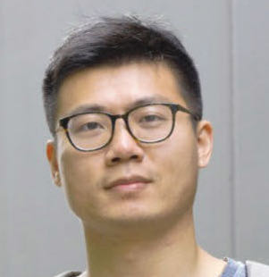

## About Me

Hi! I am a first year PhD student of Electrical and Computer Engineering at Purdue University, West Lafayette.

<!-- This is a [link](http://google.com). -->

<!-- This is a jekyll based resume template. You can find the full source code on [GitHub](https://github.com/bk2dcradle/researcher) -->

## Research Interest

1. Unsupervised Learning: Optimal transportation
2. Continual Learning: Catastrophic forgetting, Model ensemble
3. Federated Learning: Non-IID data
4. Autonomous Driving

## News

* April, 2022: I served as a PC reviewer for CVPR workshop, Vision Datasets Understanding
* Jan, 2022: I served as a reviewer for CVPR
* Aug, 2021: I joined QLab at Purdue University, working with professor Qiang Qiu.

## Publications

* Zichen Miao, Ze Wang, **Wei Chen**, Qiang Qiu: *Continual Learning with Filter Atom Swapping*, (2022) International Conference on Learning Representations (ICLR)

* I Beak, **W Chen**, Z Zhu, S Samii, R Rajkumar: *FT-DeepNets: Fault-Tolerant Convolutional Neural Networks with Kernel-based Duplication*, (2022) IEEE/CVF Winter Conference on Applications of Computer Vision (WACV)

* J Lezama, **W Chen**, Q Qiu: *Run-Sort-ReRun: Escaping Batch Size Limitations in Sliced Wasserstein Generative Models*, (2021) International Conference on Machine Learning (ICML), 6275-6285

* I Beak, **W Chen**, A Venkat, R Rajkumar: *Practical Object Detection Using Thermal Infrared Image Sensors*, (2021) IEEE Intelligent Vehicles Symposium (IV) workshop

* K Bhardwaj, **W Chen**, R Marculescu: *New directions in distributed deep learning: bringing the network at forefront of IoT design*, (2020) 57th ACM/IEEE Design Automation Conference (DAC), 1-6

* **W Chen**, K Bhardwaj, R Marculescu: *Fedmax: mitigating activation divergence for accurate and communication-efficient federated learning*, (2020) ECML PKDD, Lecture Notes in Computer Science, vol 12458. Springer, Cham.

<!-- ## Typography

This is a [link](http://google.com). Something *italics* and something **bold**.

Here is a table

Year | Award | Category
-----|-------|--------
2014 | Emmy  | Won Outstanding Lead Actor in a miniseries or a movie
2015 | BAFTA | Nominated for Best Leading Actor for Sherlock
2014 | Satellite | Won Best Actor miniseries or television film

Here is a horizontal rule

---

Here is a blockquote

> To a great mind, nothing is little

## References

* Foo Bar: Head of Department, Placeholder Names, Lorem
* John Doe: Associate Professor, Department of Computer Science, Ipsum -->
